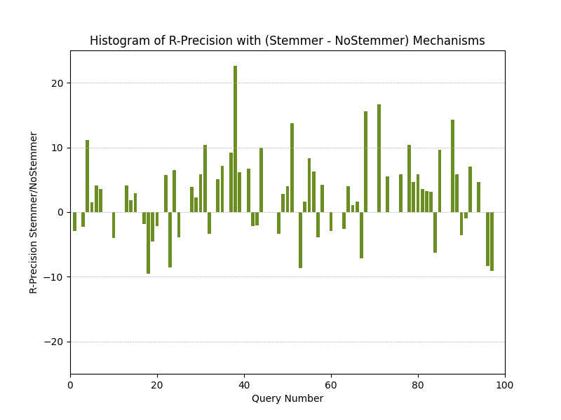
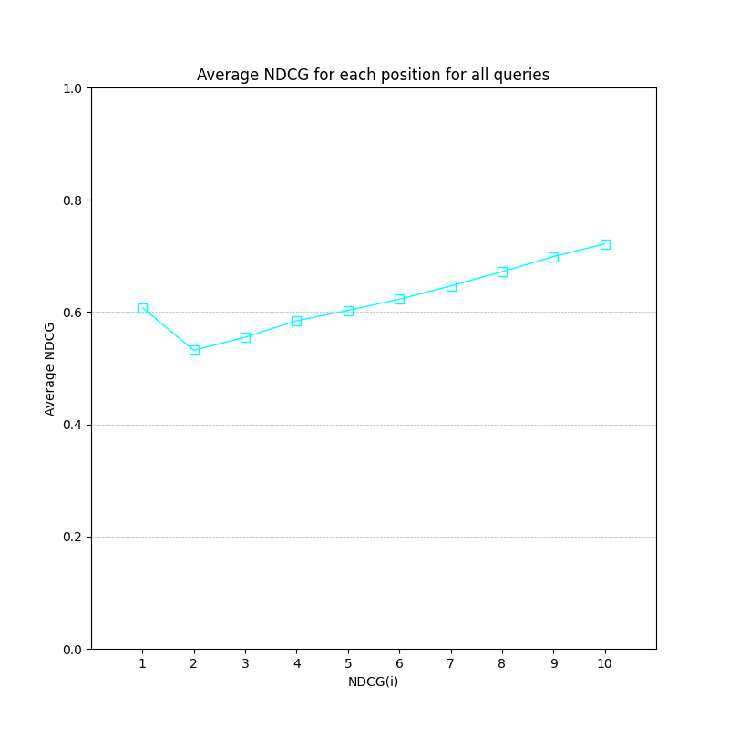

# Relatório do Trabalho de Avaliação do MEcanismo de Busca

## Construção de gráficos e obtenção dos dados

Todo o processo de criação dos gráficos, bem como a organização dos dados que os formam, está documentado em um notebook do Jupyter localizado no diretório [SRC](TrabalhoIndividual/SRC), com o nome [`AvaliacaoModeloRI.ipynb`](TrabalhoIndividual/SRC/AvaliacaoModeloRI.ipynb). Nele, estão incluídas as gerações dos gráficos dos resultados do mecanismo de busca utilizando o stemmer. Para os gráficos do mecanismo sem o uso do stemmer, foi utilizado o mesmo notebook, alterando apenas o arquivo de entrada no início.

Os arquivos CSV usados para gerar os gráficos estão armazenados no diretório [`AVALIA`](TrabalhoIndividual/SRC), assim como os próprios gráficos. O README do mecanismo foi atualizado para refletir a alteração implementada, permitindo a escolha de utilizar ou não o stemmer. Mais detalhes sobre a criação das métricas de avaliação podem ser encontrados dentro do próprio notebook.

## 1. Gráfico de 11 pontos de precisão e recall

* Stemmer

* NoStemmer

## 2. $F_1$ score

* Stemmer

* NoStemmer

## 3. Precision@5

* Stemmer

* NoStemmer

## 4. Precision@10

* Stemmer

* NoStemmer

## 5. Histograma Comparativo de R-Precision

## 6. MAP

* Stemmer

* NoStemmer

## 7. MRR

* Stemmer

* NoStemmer

## 8. Discounted Cumulative Gain

* Stemmer

* NoStemmer

## 9. Normalized Discounted Cumulative Gain

* Stemmer

* NoStemmer

